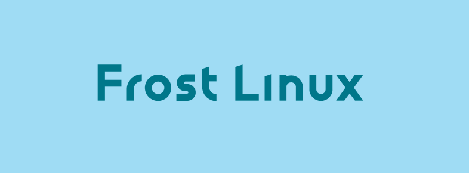
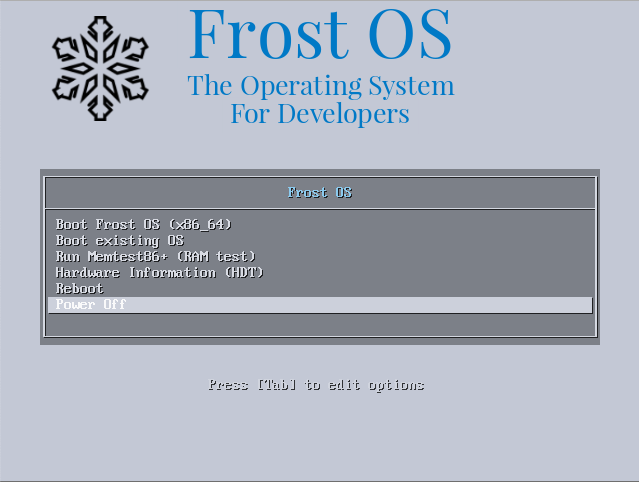
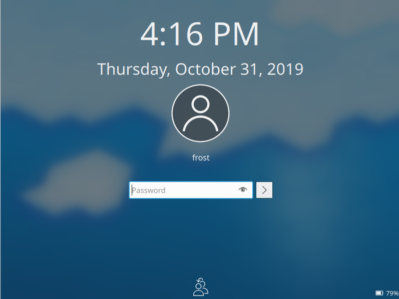
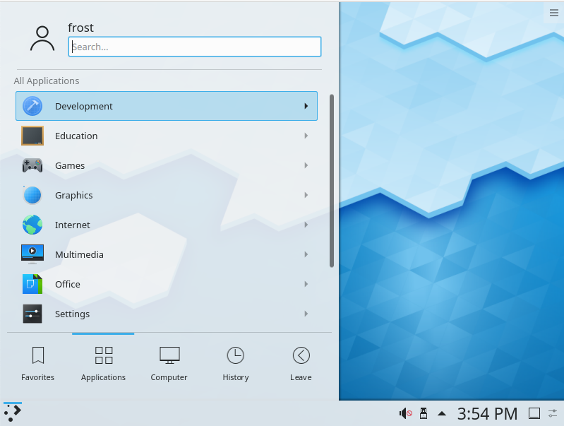
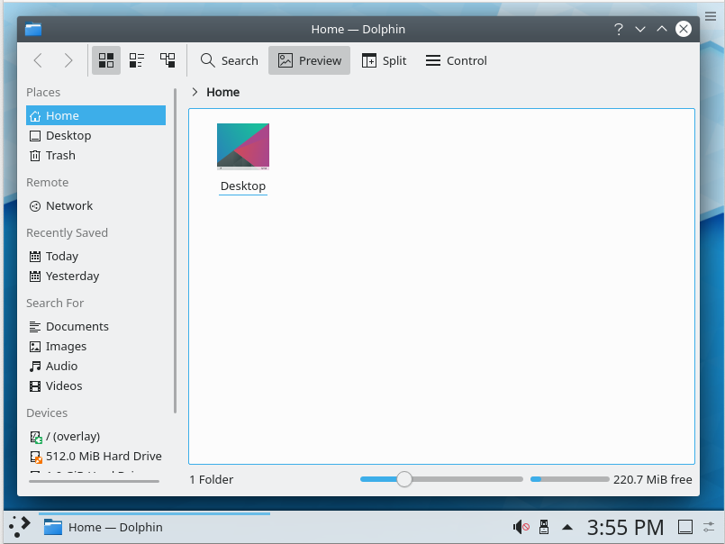

<div style="display:table-cell; vertical-align:middle; text-align:center">

</div>


## Table of Contents
1. [What is Frost Linux?](#what-is-frost-linux)
2. [Why Frost Linux?](#why-frost-linux)
3. [Applications & Software](#applications--software)
4. [Building](#building)
5. [Downloading & Installation](#downloading--installation) 
6. [Screenshots](#screenshots)
7. [Contributing to Frost](#contributing-to-frost)
8. [Copyrights and Licensing](#license)


### What is Frost Linux? 

Frost is a Linux based operating system. More specifically, it is based on Arch Linux. Frost is currently in early stages of development and is being tested continuously. Frost is designed specifically for engineers and developers everywhere. It comes prebundled with software tools and packages which are prominent among developers everywhere. It's just ready to use out of the box. It has a huge list of rich software created by the FOSS community. 


### Why Frost Linux? 

Frost has a compilation of toolsets and softwares used by developers and engineers everywhere. Frost can be used in the live mode or can be installed on a system with the Frost installer. (Based on [Calamares](http://calamares.io) Installation framework)
Frost comes with an elegant and rich UI with support for dark mode. It is a project that aims to be on par with the security and reliability of Windows and MacOS and at the same time, giving complete flexibility and control to the user. 


#### Privacy & Security 

Your privacy is our concern. All the applications pre-installed are checked for privacy violations before considering. Any data sent over is through an anonymous channel for diagnostic purposes. We are highly skeptic about security. It uses a custom built & stable Linux kernel enhanced for security. It uses Linux-Hardened, a Linux kernel implementation providing an overlay of security.

- **Userspace ASLR comparison**: Linux-Hardened provides an improved implementation of Address Space Layout Randomization for userspace processes. 
- **Restriced access to kernel logs**: Kernel logs contain critical information which may prove useful to an exploiter. The kernel ensures limited access to these logs, ensuring that sensitive information is not leaked.
- **Restricting module loading**: This feature ensures that only signed (with a valid key) kernel modules are loaded into the kernel.
- **Restricting access to kernel pointers in the proc filesystem**
- **Limited Ptrace scope**: It prevents processes from performing a ptrace call on other processes outside of their scope without CAP_SYS_PTRACE. While many debugging tools require this for some of their functionality, it is a significant improvement in security. Without this feature, there is essentially no separation between processes running as the same user without applying extra layers like namespaces. The ability to attach a debugger to an existing process is a demonstration of this weakness.
- **PIDs of other users' processes remain hidden**

The hardened kernel comes with Openwall's [Linux Kernel Runtime Guard](https://www.openwall.com/lkrg). It is a [loadable kernel module](https://en.wikipedia.org/wiki/Loadable_kernel_module) that performs runtime integrity checking of the Linux kernel and detection of security vulnerability exploits against the kernel.

Sandbox your applications with [Firejail](https://firejail.wordpress.com) which is a SUID program that reduces the risk of security breaches by restricting the running environment of untrusted applications using [Linux namespaces](https://en.wikipedia.org/wiki/Linux_namespaces) and [seccomp-bpf](https://en.wikipedia.org/wiki/Seccomp).

#### Pacman - A Powerful Package Manager

Frost Linux is built on Arch Linux. It inherits its most powerful feature, the package manager - Pacman. It ensures that your packages and their dependencies are managed with breeze. Pacman gives complete control over which packages to download, which dependencies to remove/install and keeps all the softwares up-to-date. Pacman can be configured to choose download mirrors as per your choice. Pacman provides access to millions of packages built by developers and the community. Check [here](https://aur.archlinux.org) for more information. 

#### The Power of Customisation 

Frost has powerful customisation options. You can build the entire system from scratch, choosing from the millions of packages on the Pacman store of repositories. From choosing your bootloader to the desktop enviroment and softwares, Frost is completely in your hands.  


### Applications & Software

Frost Linux is a bundle of curated applications loved by developers around the world.

| Sr. No 	| Software     	| Description                                                                                                                                                             	|
|--------	|--------------	|-------------------------------------------------------------------------------------------------------------------------------------------------------------------------	|
| 1.     	| Firefox      	| An open source, fast browser by Mozilla foundation                                                                                                                      	|
| 2.     	| VS Code      	| The most loved source code editor by Microsoft                                                                                                                          	|
| 3.     	| Fish         	| The friendly interactive shell                                                                                                                                          	|
| 4.     	| Squid        	| A lightweight HTTP web proxy                                                                                                                                            	|
| 5.     	| Apache       	| HTTP web server by Apache Group                                                                                                                                         	|
| 6.     	| Youtube-dl   	| A CLI tool for downloading Youtube videos                                                                                                                               	|
| 7.     	| Nginx        	| A web server, reverse proxy, load balancer, mail proxy and HTTP cache store                                                                                             	|
| 8.     	| Transmission 	| A Bit-torrent client                                                                                                                                                    	|
| 9.     	| FileZilla    	| The free FTP solution for both client and server                                                                                                                        	|
| 10.    	| RClone       	| A CLI tool to sync files and directories to and from cloud services                                                                                                     	|
| 11.    	| Inetutils    	| GNU's must have network utilities                                                                                                                                       	|
| 12.    	| Thunderbird  	| A free email application that's easy to set up and customize                                                                                                            	|
| 13.    	| HexChat      	| A cross-platform IRC client                                                                                                                                             	|
| 14.    	| Remmina      	| A feature rich remote desktop application                                                                                                                               	|
| 15.    	| Tiger VNC    	| A high-performance, platform-neutral implementation of VNC. (Client & Server)                                                                                           	|
| 16.    	| GwenView     	| An image viewer by KDE                                                                                                                                                  	|
| 17.    	| Tmux         	| The terminal multiplexer that everyone needs. Split terminal panes and restore SSH sessions with breeze.                                                                	|
| 18.    	| Handbrake    	| An audio transcoder and editing toolset.                                                                                                                                	|
| 19.    	| Audacity     	| Audacity is a free and open-source digital audio editor and recording application software.                                                                             	|
| 20.    	| ffmpeg       	| Free and open-source project consisting of a vast software suite of libraries and programs for handling video, audio, and other multimedia files and streams.           	|
| 21.    	| VLC          	| free and open-source project consisting of a vast software suite of libraries and programs for handling video, audio, and other multimedia files and streams.           	|
| 22.    	| GIMP         	| GIMP is a free and open-source raster graphics editor used for image retouching and editing, free-form drawing, converting between different image formats,             	|
| 23.    	| OpenSSL      	| OpenSSL is a software library for applications that secure communications over computer networks against eavesdropping or need to identify the party at the other end.  	|
| 24.    	| Git          	| The version control system loved and used by developers all across the world.                                                                                           	|
| 25.    	| Umbrello UML 	| Umbrello UML Modeller is a free software UML diagram tool                                                                                                               	|
| 26.    	| Leafpad      	| A lightweight simple text editor.                                                                                                                                       	|
| 27.    	| LibreOffice  	| A comprehensive office suite.                                                                                                                                           	|
| 28.    	| Pandoc       	| Pandoc is a free and open-source document converter, widely used as a writing tool and as a basis for publishing workflows.                                             	|
| 29.    	| Wireshark    	| Wireshark is a free and open-source packet analyzer. It is used for network troubleshooting, analysis, software and communications protocol development, and education. 	|
| 30.    	| KeePass      	| KeePass Password Safe is a free and open-source password manager.                                                                                                       	|
| 31.    	| Htop         	| Htop is an interactive system-monitor process-viewer and process-manager.                                                                                               	|
| 32.    	| ExifTool     	| ExifTool is a free and open-source software program for reading, writing, and manipulating image, audio, video, and PDF metadata.                                        	|
| 33.    	| Kompare      	| Kompare is a graphical diff and merge tool targeting developers. It allows users to compare two different text files or two directories.                                	|


Apart from these, numerous commandline tools are bundled with Frost that make your experience with Linux convenient.
 
### Building

Frost can be built with complete customisation. However, the build scripts will run only on an Arch Linux installation due to Arch Linux specific programs used to build Frost Linux. You will need to download Archiso from Pacman and build tools.
On an existing Arch Linux installation you can get these with -  
```bash
$ pacman -S build-devel archiso
```

After installing the development build tools, clone the repository and add the names of the packages to be installed to packages.x86_64. It is recommended to keep the syslinux/isolinux bootloader folders as they are. Experienced Linux users can go for bootloader customisation as well. Currently Frost works only on x64 systems. Future support for ARM will be added. 

```bash
$ git clone https://github.com/chaitanyarahalkar/Frost-Linux.git
$ cd Frost-Linux
$ ./build.sh -v
```
The build scripts need an active internet connection. Time required to build the ISO varies as per the processor speed, the internet connection and number of programs listed in the packages file. A ready to use ISO will be generated in the ``` out/ ``` directory if the build is finished successfully.

Frost uses [SqashFS](https://en.wikipedia.org/wiki/SquashFS) to compress the root file system. Syslinux/isolinux is the default bootloader.

### Downloading & Installation 

Frost can be downloaded from [here](https://osdn.net/projects/frostos/storage/frostos-2019.09.18-x86_64.iso/). It is bundled as an ISO image which can be flashed to a USB drive or a CD/DVD. In future releases, Frost will be available in both headless mode and GUI mode, with a complete customised desktop environment. The current release comes with [KDE Plasma](https://kde.org/plasma-desktop) as the desktop environment. 
It is recommended to use a flashing tool like [Etcher](https://www.balena.io/etcher/) to flash the ISO to a USB drive. Use a CD/DVD burner to flash it to a CD/DVD. 
The other way to flash the drive is using the dd utility. Erase the contents of the flash drive by formatting it. 

```bash
$ mkfs.ext4 /dev/sdx
```
This will create the *ext4* file system on the USB drive, which is recommended.
Copy the ISO to the USB drive using dd. 

```bash
$ dd bs=4M if=path/to/frost.iso of=/dev/sdx status=progress oflag=sync
```

On getting the bootloader screen, select the live mode. The default credentials for Frost are
```bash
username: frost
password: frost
```

Frost will greet you with an installation script that will guide you through the process of installing it on your hard drive.

### Screenshots



Boot Loader
***


Login Screen
***


Menu
***


***

### Contributing to Frost

Frost is a project in its early stages of development.
Contributions, issues and feature requests are welcome!<br />Feel free to check [issues page](https://github.com/chaitanyarahalkar/Frost-Linux/issues).

### Show your support

Give a ⭐️ if this project helped you!

### License

Copyright © 2019 [Chaitanya Rahalkar](https://github.com/chaitanyarahalkar).<br />
This project is [MIT](https://github.com/chaitanyarahalkar/Frost-Linux/blob/master/LICENSE) licensed.


